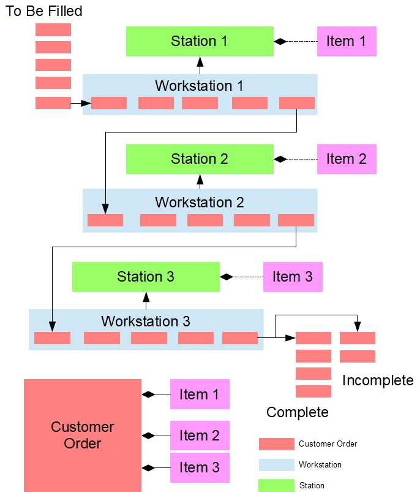

# Assembly_Line_Simulation

The purpose of this term project is to put your C++ Object-Oriented skills into practice by developing a simulation of an assembly line with any number of stations. The assembly line consists of workstations, each of which holds specific stock items and fills customer orders. A line manager moves customer orders along the line, filling orders at each station as requested.

